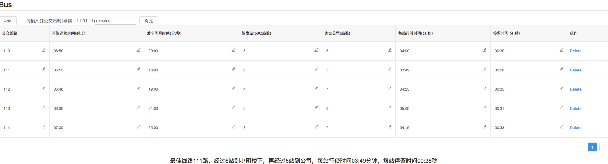

#   webpack作业
###  需要用到webpack打包，其他随意发散

小明楼下有N趟公交车可以到公司，每趟公交车开始运营时间，经过的站数，每站行使时间，停留时间都各不相同，请实现如下功能：

- 输入小明到公交站的时间，输出能最快让小明到公司的公交线路
- 可以增加和删除公交线路
- 可以调整公交线路的运营时间，站数，行驶时间等参数

例：

- 公交线路110路，经过3站到小明楼下，再经过5站到公司，每站行使时间4分钟，每站停留时间30秒
- 公交线路120路，经过5站到小明楼下，再经过3站到公司，每站行使时间5分钟，每站停留时间1分5秒

### 展示一个成品图

