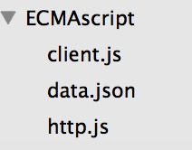
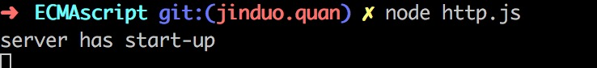
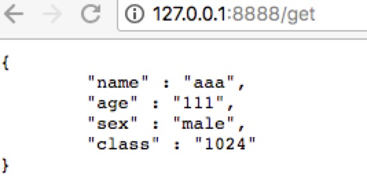
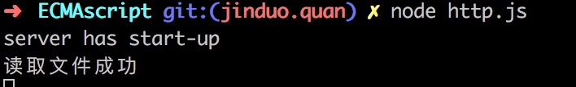
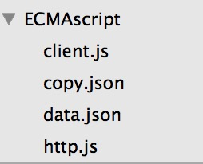
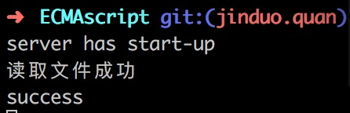

#ECMAscript课后作业
### 用es6 + promise + node，实现文件的读取及拷贝
### 说明：

目录有三个文件，分别是启动node的http.js，拷贝文件的client.js，以及要拷贝的文件data.json

启动http.js

页面输入对应路径读取到文件信息

同时node打印读取成功

启动client.js
输出拷贝成功，同时向client.js发送一条成功信息，即post成功，然后end掉client的node服务

此时目录下多了一个copy.json的文件，内容和data.json相同

http.js收到一条success

### 需要会的知识点：
1. promise
2. http.createServer
3. es6
4. fs

### 注：不引入babel的情况下，node需要在严格模式下才能使用es6

